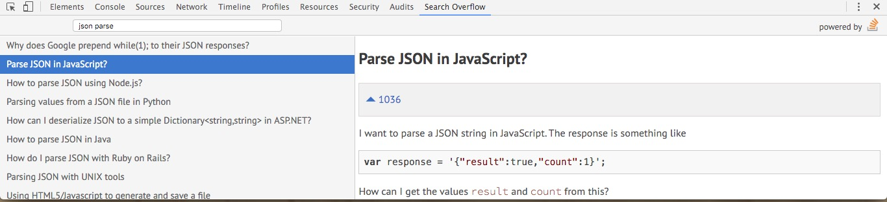

# Search Overflow
Browser extension that lets you search Stack Overflow from within the DevTools.

## Features:
- instant searching
- complete QA data with code snippets
- arrow key navigation:
  - Left-Right to switch between panes
  - Up-Down to move between questions

### Todo:

  - Add task runner. i.e: Grunt or Gulp
  - Solve Issue #1
  - Port it to Angular (or React?)
